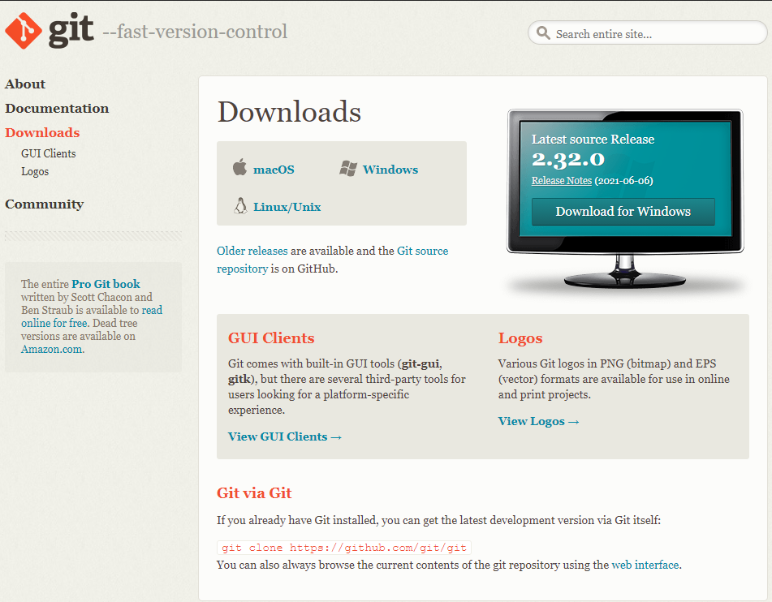

[< К содержанию](./../readme.md)

---

# Установка клиента Git

- Переходим на сайт [Git в раздел Download](https://git-scm.com/downloads "Жмяк");
- Для **Windows** выбираем дистрибутив в зависимости от разрядности ОС и её разрядности (если система не определила автоматически);
- Для [MacOS](https://git-scm.com/download/mac "Жмяк") и [Linux\Unix](https://git-scm.com/download/linux "Жмяк") систем следуем инструкции;
- [Переходим к первоначальной настройке](./initial_setup.md).

---
